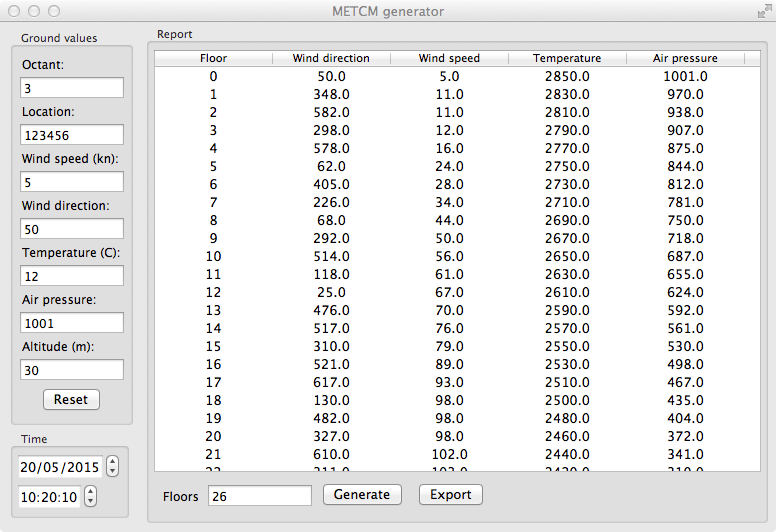

# METCM reports generator

This piece of software can be used to generate METCM weather reports which can be used
while drilling artillery routine. 

This software is written in Java and will smoothly run under Mac, Window, Nix* operating systems.



## Download links

Windows 32bit:

Windows 64bit:

OSX:

## Creating an executable

In order to make a build for your operating system you need to modify *pom.xml* and change *<swtVersion>*
configuration property to match an operating system where you are plannig to use the generator and then use
Maven to compile source code and make a package for you, the software has been developed using Java 1.8 and
it is recommended to use this version to build a package.

When a .jar (check "target" directory") file is ready you can run it by simply double clicking on it or from console using a similar command:

```bash
java -jar org.lissovski.metcmgenerator-1.0.0-jar-with-dependencies.jar
```

If you intend to run the generator under OSX, you need to specify additional flag "-XstartOnFirstThread":

```bash
java -XstartOnFirstThread -jar org.lissovski.metcmgenerator-1.0.0-jar-with-dependencies.jar
```

## Licensing

This application is under the MIT license. See the complete license in the bundle: 
meta/LICENSE